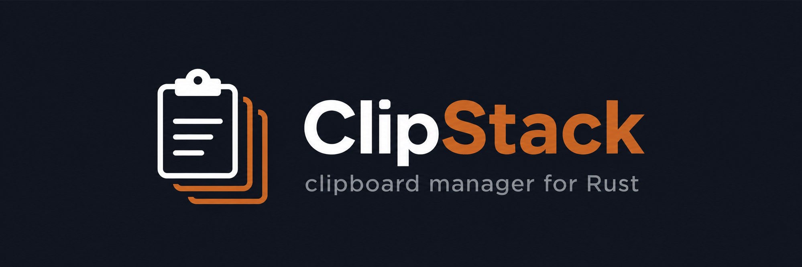
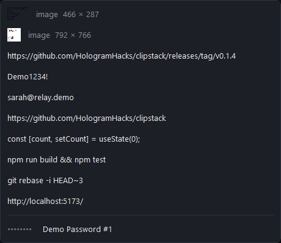

<p align="center">
  
</p>

# ClipStack

A tiny clipboard-history popup for Windows. Middle-click anywhere, pick from your last 50 clips, and it pastes straight into whatever field you were typing in.

Written in Rust — raw Win32, no UI framework, single file.

<p align="center">
  
</p>

## Download & run (no Rust needed)

Grab the latest `clipstack.exe` from the [**Releases**](https://github.com/HologramHacks/clipstack/releases/latest) page and run it. That's it — no installer, no runtime, no dependencies. It's a single ~0.5 MB file that lives in your system tray.

First launch shows a Windows SmartScreen warning (it's unsigned) — click **More info → Run anyway**.

## Using it

ClipStack sits in your system tray. Middle-click is the default opener (you can remap it — see below):

| Action | What happens |
|---|---|
| **Middle-click** anywhere | Opens the history popup at your cursor |
| **Mouse wheel** (popup open) | Scrolls through older clips |
| **Left-click** a row | Copies that clip *and* pastes it into the field you were in |
| **Click the ✕** on a row | Removes that clip from history |
| **Right-click** a clip | Pins it with a label (kept until you remove it) |
| **Right-click** a pin | Unpins it |
| **Right-click the tray icon** | Choose the trigger · Launch at startup · Remember history · Pause capture · Clear history · Quit |

### Changing the trigger

Middle-click is the default, but you can remap it from the tray: **right-click the tray icon → Trigger**. Pick a preset (middle, Mouse 4 / Mouse 5, or **Ctrl+Shift+V**), or choose **Set custom trigger…** and press any modifier+key combo or mouse button. When a mouse button is your trigger, ClipStack takes it over completely — so e.g. a Back/Forward button stops navigating while it's mapped. A keyboard trigger leaves the mouse untouched until you press it (handy if you use the middle/thumb buttons in apps like games or 3D tools). Your choice is remembered across restarts.

> Got a mouse with extra buttons? Windows only exposes five buttons to apps (left, right, middle, and the two thumb buttons), so the rest aren't visible to ClipStack — or any app. Map one to a key combo in your mouse software, then set that combo as a custom trigger.

### Start with Windows

Right-click the tray icon and tick **Launch at startup** to have ClipStack open when you log in. It's **off by default** and just adds a per-user `Run` entry — untick it to remove. (No admin rights, nothing system-wide.)

### Remember history (opt-in)

By default your history is **memory-only** — it vanishes when ClipStack closes. If you'd rather it be there after a reboot or crash (like an editor restoring your tabs), tick **Remember history** in the tray. While it's on, your **text** clips are saved **DPAPI-encrypted** to `%APPDATA%\ClipStack\history.dat` and reloaded on launch; it's flushed continuously, so a crash loses at most the last half-second. It's **off by default** — the trade-off is that copied text (including anything sensitive) then lives on disk, encrypted at rest, until you clear it. Untick it (or **Clear history**) to delete the file. Images stay memory-only either way.

## What it does

- Keeps your last **50 clips** — text *and* images
- The popup opens right at your cursor and **never steals focus** from what you're doing
- **Pinned secrets** are masked on screen and stored DPAPI-encrypted on disk — passwords/tokens never sit in plaintext
- **No cloud, no network** — your clipboard never leaves your machine
- **Tiny** — a single ~0.5 MB exe, no runtime, no dependencies

## Build from source

Only needed if you want to compile or change it yourself. Needs [Rust](https://rustup.rs/) and Windows.

```sh
cargo build --release
```

The binary lands at `target/release/clipstack.exe`. Run it; it lives in the tray. Middle-click anywhere to use it.

## How it works (the short version)

Everything runs single-threaded on one Win32 message loop. The low-level mouse hook and the window procedure both run on that one thread, so the global state is only ever touched there — borrows are scoped so the `&mut` is never held across a call that pumps messages (menus, dialogs). Clips are deduped by hash; pinned secrets go through `CryptProtectData` (DPAPI).

## Why I built it

I wanted a clipboard manager that was instant, stayed out of the way, and didn't ship my clipboard off to a cloud service — so I built one, in Rust. It's small, fast, and mine.

## Security notes

- Clipboard **history lives only in memory by default** — never written to disk, wiped on exit. (The opt-in **Remember history** setting changes this: while it's on, text clips are saved DPAPI-encrypted to `%APPDATA%\ClipStack\history.dat` until you clear them. It's off unless you turn it on.)
- **Pinned secrets** are encrypted at rest with Windows DPAPI (per-user) in `%APPDATA%\ClipStack\pins.dat`. That protects them on disk, but note the limits: any program running as the *same Windows user* can ask DPAPI to decrypt them, and when you paste a pin it lands on the normal Windows clipboard in cleartext (that's the whole point). So treat it as "encrypted at rest, per user," not "hidden from everything."
- ClipStack uses a **global mouse hook** (to catch your open shortcut) and **reads the clipboard on a short timer** (that's how history is built) — the same behaviors some malware uses, so an unsigned build may trip a SmartScreen or antivirus warning. It's all local: no keystroke logging, nothing leaves your machine, and the full source is right here to check.
- Your trigger choice is saved in plaintext at `%APPDATA%\ClipStack\settings.txt` — it's just a key/button name, not a secret.
- **No network, no telemetry, no analytics.** ClipStack never opens a network connection.

## License

MIT — see [LICENSE](LICENSE).

---

Built by Brian Jones — [hologramhacks.com](https://hologramhacks.com)
